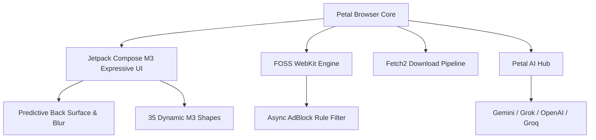

# 🌸 Petal Browser

<div align="center">

  

  <h2>Petal Browser</h2>

  <p><strong>Fast, Ultra-Lightweight & Privacy-Focused Android Web Browser built with Jetpack Compose & Material 3 Expressive Design</strong></p>

  [](https://github.com/shreyagarwal72/petal_browser/releases/latest)
  [](https://github.com/shreyagarwal72/petal_browser/actions/workflows/android_build.yml)
  [](https://t.me/championworkspace)
  [](LICENSE.md)

</div>

---

## 🌟 At a Glance

| 🎨 **Design System** | ⚡ **Performance** | 🛡️ **Privacy & Security** | 🤖 **AI & Intelligence** |
| :--- | :--- | :--- | :--- |
| **Material 3 Expressive** with 35 dynamic polygon shapes | **Hardware-accelerated** WebKit rendering engine | **Multi-threaded AdBlock** & tracking protection | **Petal AI Hub** supporting Gemini, Grok, GPT & Claude |
| **Living background mesh** with dynamic palette theming | **Staggered spring animations** & fluid gesture physics | **Zero telemetry**, zero analytics, 100% private | **AI Search & Research**, smart summaries & page Q&A |
| **Predictive Back** dual-surface depth blur | **Low RAM consumption** with instant tab switching | **Granular site permissions** & secure cookie isolation | **Integrated Download Manager** with background fetch |

---

## ✨ Key Features & Highlights

### 🎨 Material 3 Expressive Design & Fluid Motion
- **35 Material 3 Expressive Shapes**: Every shortcut icon, search pill, and floating component renders with distinct dynamic polygon geometry (squircle, petal, diamond, flower, pill, and more).
- **Living Variable Background**: Dynamic procedural ambient backdrop responding smoothly to daylight and palette shifts.
- **Predictive Back & Depth Blur Physics**: Smooth back gesture with real-time GPU background scaling and dual-surface depth blur.
- **Dynamic Theming & AMOLED Pure Black**: Full support for Android 12+ wallpaper dynamic color extraction, tonal palettes, and true AMOLED `#000000` pitch black mode.
- **GS Flex & Expressive Typography**: Customizable variable font system with real-time preview and instant layout switching.

### 🌐 Smart Omnibox & Browsing Experience
- **Chrome & Edge Style Omnibox**: Responsive address bar featuring security lock indicators, instant domain breakdown, and fast site settings.
- **Scroll-Linked Collapse**: Auto-collapsing address bar with floating action bubble (`fab_bubble`) and spring physics.
- **60fps Tab Grid Switcher**: 2-column live tab grid with swipe-to-dismiss, instant thumbnail caching, and incognito tab segregation.
- **Custom Shortcut Manager**: Pin and customize your favorite web shortcuts with color palettes, custom icons, and auto-visited recommendations.

### 🤖 Petal AI Hub & Smart Assistant
- **Universal Multi-Model Integration**: Connect your own API keys for **Google Gemini**, **Groq**, **OpenAI**, **xAI Grok**, or **OpenRouter**.
- **Page Summaries & Deep Research**: Summarize complex web pages or run in-depth research queries with citations in a single tap.
- **Contextual AI Actions**: Select any text on a page to translate, explain, rephrase, or query AI without leaving your tab.

### 🛡️ Uncompromising Privacy & Content Protection
- **Multi-Threaded Ad & Tracker Shield**: Fast asynchronous domain filtering engine with customizable hostlists.
- **Zero Telemetry Guarantee**: No background metrics, user tracking, advertising SDKs, or server analytics.
- **Multi-Engine Search Selector**: Instant switching between DuckDuckGo, Brave, Startpage, SearXNG, Google, Bing, Qwant, and Ecosia.
- **Granular Site Controls**: Instant toggling of JavaScript, cookies, location permissions, images, and desktop mode per tab.

### ⚡ Power Tools & Integrations
- **Resumable Download Manager**: Multi-threaded background file download engine with pause, resume, real-time speed monitoring, and auto-categorization.
- **Chrome Account & Cloud Sync**: Profile avatar integration with secure sync preference state management.
- **Dedicated Open Source Credits**: Built-in attribution hub honoring upstream projects, frameworks, and contributing developers.
- **Termux & Android Power User Ready**: Optimized build workflow and lightweight footprint designed for both standard Android and power-user environments.

---

## 🛠️ Architecture & Tech Stack



- **Languages**: Kotlin 2.0+ & Java 17
- **UI Toolkit**: Jetpack Compose (BOM 2026.06.01) with Material 3 Expressive (`1.5.0-alpha17`)
- **Image Pipeline**: Coil Kotlin Coroutines
- **Download Engine**: Fetch2 Multi-threaded Downloader
- **Minimum OS**: Android 8.0 (API 26)
- **Target OS**: Android 15 (API 35)
- **Build System**: Gradle 8.11+ with Android Gradle Plugin 8.7+

---

## 💻 Build & Install

To build the debug APK locally:

```bash
# Clone the repository
git clone https://github.com/shreyagarwal72/petal.git
cd petal

# Compile debug build
./gradlew assembleDebug
```

The APK will be generated at:
```
app/build/outputs/apk/debug/app-debug.apk
```

---

## 💖 Open Source Credits & Upstream Projects

Petal Browser is built on the shoulders of giants. We express our deepest gratitude to:
- **[FOSS Browser](https://github.com/scoute-dich/browser)** by *scoute-dich* — Core Android browser engine & clean WebKit architecture.
- **[Zenith](https://github.com/1372Slash/Zenith)** by *1372Slash* — Material Design 3 Expressive motion physics & digital wellbeing framework.
- **[LastWave](https://github.com/duxtami/LastWave-native)** by *duxtami* — Hi-Res lossless audio streaming architecture & Material 3 design.
- **[Aurora Store](https://github.com/whyorean/AuroraStore)** by *whyorean (Rahul Patel)* — Modern Material design patterns & elegant app architecture.
- **[RvSystem-Monitor](https://github.com/Rve27/RvSystem-Monitor)** by *Rve27* — Real-time system monitoring & Compose hardware insights.
- **[Ever-Haptics](https://github.com/hari161008/Ever-Haptics)** by *hari161008* — Waveform haptic vibration synthesis & tactile interaction.
- **[PixelPlayer](https://github.com/PixelPlayerHQ/PixelPlayer)** by *PixelPlayerHQ* — Dynamic palette styling and morphing squircle motion framework.
- **[Fetch](https://github.com/tonyofrancis/Fetch)** by *tonyofrancis* — Multi-threaded background download engine.
- **[Coil](https://github.com/coil-kt/coil)** by *coil-kt* — Image and favicon caching pipeline.
- **[Material 3 Expressive](https://m3.material.io)** by *Google Android Jetpack Team* — Expressive component geometry and dynamic color palettes.

---

## 📜 License

Licensed under the **[GNU General Public License v3.0 (GPL-3.0)](LICENSE.md)**.
Free and Open Source Software. You are welcome to redistribute and modify it under the terms of the GPL-3.0.