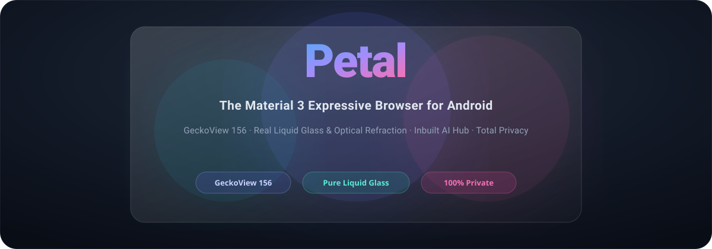

<div align="center">



<br>

**A browser that respects your attention, privacy, and device.**<br>
Material 3 Expressive, powered by GeckoView 156 with pure Liquid Glass.<br>
No telemetry, no tracking, no bloat — built for ultimate speed and aesthetics.

<br>

<a href="https://github.com/NikhilKain/Petal/releases/latest"></a>

<a href="LICENSE"></a>

<br><br>

[Why Petal](#why-another-browser) · [Features](#whats-inside) · [Install](#install) · [Build](#build-it-yourself) · [Under the Hood](#under-the-hood) · [License](#license)

</div>

<br>

## Why another browser?

Most browsers on Android are Chromium wrappers loaded with account sign-ins, news feeds, telemetry, and background trackers that drain battery and collect your browsing habits.

**Petal** is built differently. Powered by a modern **GeckoView 156** engine, it delivers desktop-grade standards compliance, native ad blocking, and a fluid user experience adhering strictly to **Material 3 Expressive** guidelines. Featuring authentic **Liquid Glass** surfaces with hardware-accelerated backdrop blur, chromatic aberration, and lens refraction, Petal combines state-of-the-art aesthetics with zero-compromise privacy.

---

## What's inside

<table>
<tr>
<td width="50%" valign="top">
<br>
<b>GeckoView 156 Powerhouse</b><br>
Runs on Mozilla's GeckoView 156 engine with full multi-process architecture, quantum rendering, and web standards compliance. Independent of the system Chromium WebView.
</td>
<td width="50%" valign="top">
<br>
<b>Pure Liquid Glass & M3 Expressive</b><br>
Material 3 Expressive morphing surfaces with real optical refraction, adaptive corner smoothing, and customizable backdrop blur tinting. Seamlessly adapts to your dynamic color palette.
</td>
</tr>
<tr>
<td width="50%" valign="top">
<br>
<b>Zero Telemetry & Strict Isolation</b><br>
Strict tracking protection enabled by default. No analytics, no diagnostic pings, no proprietary clouds. Your history, tabs, and sessions stay encrypted locally on your device.
</td>
<td width="50%" valign="top">
<br>
<b>Built-in Ad & Tracker Blocker</b><br>
Block intrusive ads, banners, crypto miners, and fingerprinting scripts before they even reach your screen. Enjoy blazing fast page loads with lower cellular data consumption.
</td>
</tr>
<tr>
<td width="50%" valign="top">
<br>
<b>Inbuilt On-Device AI Hub</b><br>
Chat, summarize web pages, rewrite text, and query content directly inside the browser using your favorite provider (OpenAI, Anthropic, Gemini, Groq, Ollama) or on-device local models.
</td>
<td width="50%" valign="top">
<br>
<b>Integrated Media & Download Manager</b><br>
Sniff and download streaming media, audio, and documents with multi-threaded downloads, resume support, background service persistence, and organized destination folders.
</td>
</tr>
<tr>
<td width="50%" valign="top">
<br>
<b>Tab Isolation & Visual Switcher</b><br>
Material 3 Expressive grid and carousel tab switchers, incognito private tabs, session persistence across restarts, and instant tab search with zero memory leaks.
</td>
<td width="50%" valign="top">
<br>
<b>WebExtension Add-on Ecosystem</b><br>
Install and run Mozilla add-ons and Firefox extensions natively. Customize your browsing experience with user scripts, password managers, and dark mode enhancers.
</td>
</tr>
</table>

---

## Install

### GitHub Releases (Recommended)
Grab the latest signed universal or architecture-specific APK directly from GitHub:

[](https://github.com/NikhilKain/Petal/releases/latest)

```bash
# Or install via ADB directly
adb install -r Petal-release.apk
```

---

## Build it yourself

Petal uses Gradle and the standard Android toolchain. Java 17+ and the Android SDK (API 34+) are required.

```bash
# Clone the repository
git clone https://github.com/NikhilKain/Petal.git
cd Petal

# Build a debug APK
./gradlew assembleDebug

# Build an optimized release APK
./gradlew assembleRelease
```

The compiled APK will be located at:
`app/build/outputs/apk/release/app-release-unsigned.apk`

---

## Under the hood

| Component | Technology / Library |
| :--- | :--- |
| **Language** | Kotlin 1.9+ |
| **Engine** | Mozilla GeckoView 156 (arm64-v8a, armeabi-v7a, x86_64) |
| **UI Framework** | Jetpack Compose + Material 3 Expressive components |
| **Visual Effects** | Liquid Glass (RenderEffect / RenderScript blur fallback, optical refraction shader) |
| **Architecture** | Clean Architecture / MVVM with Kotlin Coroutines & Flows |
| **Storage & Cache** | Room Database + SQLite, encrypted preferences |
| **Target Android** | Android 8.0 (API 26) through Android 15 (API 35) |

---

## License

Petal is free and open-source software distributed under the terms of the **GNU General Public License v3.0**.

```
Petal Browser
Copyright (C) 2024-2026 Nikhil Kain and contributors.

This program is free software: you can redistribute it and/or modify
it under the terms of the GNU General Public License as published by
the Free Software Foundation, either version 3 of the License, or
(at your option) any later version.
```
