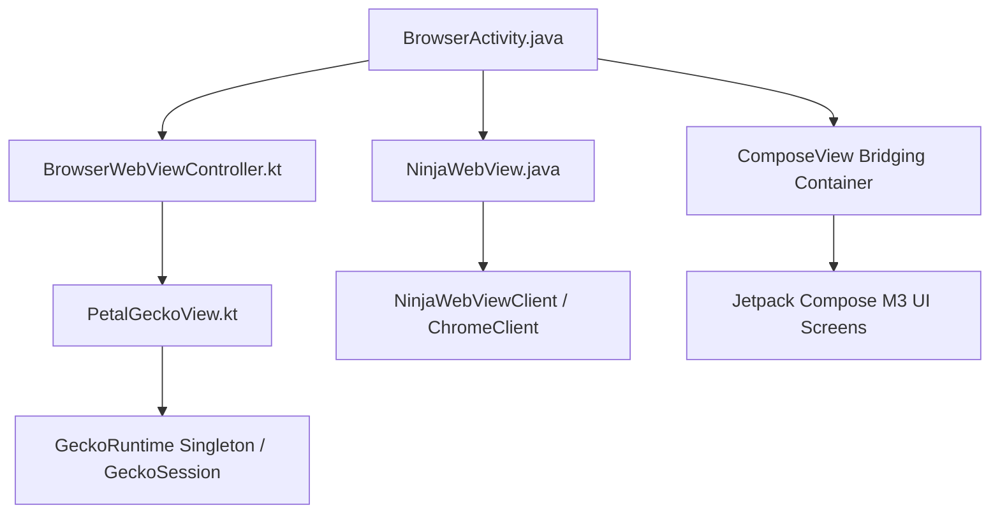

# Petal Browser Architecture (architecture.md)

## 1. System Overview & Dual-Engine Model
Petal Browser employs a hybrid architectural foundation combining a robust Java Android Activity lifecycle foundation (forked and refined from FOSS Browser) with modern Kotlin & Jetpack Compose declarative UI layers.

### Browsing Core Architecture
The browsing subsystem supports two distinct rendering engines:
1. **Mozilla GeckoView (Modern Standalone Engine)**:
   - **Artifact**: `org.mozilla.geckoview:geckoview:154.0.20260824154132`.
   - **Runtime Management**: Managed by the thread-safe process singleton `com.petal.browser.engine.gecko.PetalGeckoRuntime`. Configures strict anti-tracking, third-party cookie blocking, safe browsing, and JavaScript settings.
   - **View & Tab Layer**: Implemented in `com.petal.browser.view.PetalGeckoView`, which encapsulates `GeckoView` and `GeckoSession`. Implements `AlbumController` and AndroidX `NestedScrollingChild3` to integrate smoothly with the browser's address bar collapse, swipe refresh, and tab overview.
   - **Controller Wiring**: Managed through `com.petal.browser.controller.BrowserWebViewController`.
2. **Chromium / Android System WebView (Legacy Baseline Engine)**:
   - Implemented via `com.petal.browser.view.NinjaWebView` extending `android.webkit.WebView`.
   - Coordinated through `com.petal.browser.browser.NinjaWebViewClient` and `com.petal.browser.browser.NinjaWebChromeClient`.
   - Retains legacy FOSS Browser naming conventions for maximum backward compatibility.



---

## 2. ComposeView Bridging Pattern & ViewTree Requirements
Rather than rewriting the entire application into a single-activity Compose navigation graph, Petal embeds Jetpack Compose modular screens into `BrowserActivity` using dynamic `ComposeView` bridging.

### Presentation Workflow
- The primary container is `PullToRefreshFrameLayout contentFrame` inside `activity_main.xml`.
- Sub-screens (Settings, Tab Switcher, Downloads, History, Bookmarks, Omnibox, Credits, Reader, Incognito Home) are generated via companion bridge objects (e.g., `PetalSettingsBridge`, `PetalVideoPlayerOverlayBridge`).
- Screens are presented via `BrowserActivity.presentComposeScreen(View screen, boolean animate)`.

### Mandatory ViewTree Wiring
When embedding a dynamic `ComposeView` into a Java `Activity`, the Compose runtime requires explicit ownership definitions. Failing to provide these causes runtime crashes during composition:
```kotlin
composeView.apply {
    setViewTreeLifecycleOwner(activity)
    setViewTreeViewModelStoreOwner(activity)
    setViewTreeSavedStateRegistryOwner(activity)
    setViewCompositionStrategy(ViewCompositionStrategy.DisposeOnViewTreeLifecycleDestroyed)
}
```

---

## 3. Navigation & Predictive Back Handling
Back gesture dispatching is carefully split between the native Android platform dispatcher and Compose-level gesture interceptors:

1. **Activity-Level Back Dispatcher (`BrowserActivity.java`)**:
   - Registers an `OnBackPressedCallback` with the system `OnBackPressedDispatcher`.
   - Listens to `handleOnBackStarted`, `handleOnBackProgressed`, `handleOnBackPressed`, and `handleOnBackCancelled`.
   - Checks `isOverlayScreenShowing` to determine whether a Compose screen or the web album is currently visible.
   - Coordinates with `isDecorOverlayShowing` for window-level overlays (such as App Lock via `PetalAppLockBridge`).
2. **Compose-Level Predictive Back Handler (`PetalPredictiveJunction.kt`)**:
   - Uses AndroidX `PredictiveBackHandler` inside Compose surfaces.
   - Computes real-time progress physics, applying surface scaling, corner radius morphing, and backdrop blur (`PetalContentSnapshot`).
3. **Display Edge Gesture Exclusion Reset**:
   - To prevent the web rendering surface from trapping Android 10+ (API 29+) system edge gestures, `NinjaWebView` and `PetalGeckoView` actively enforce empty system gesture exclusion rects on touch interactions (`ACTION_DOWN`, `ACTION_UP`, `ACTION_CANCEL`).

---

## 4. Subpackage Directory Structure
- `com.petal.browser.activity`: Core Android activities (`BrowserActivity`, `Settings_Activity`, `AppLockActivity`).
- `com.petal.browser.browser`: Core browser contracts and clients (`BrowserController`, `AlbumController`, `NinjaWebViewClient`, `NinjaWebChromeClient`).
- `com.petal.browser.view`: Engine rendering views (`PetalGeckoView`, `NinjaWebView`).
- `com.petal.browser.engine`: Low-level engine integrations (`PetalGeckoRuntime`, `ChromiumNativeEngineCore`, `FullscreenVideoRules`).
- `com.petal.browser.compose`: Jetpack Compose UI surfaces (settings, tabs, omnibox, context menus, video player).
- `com.petal.browser.predictive`: Predictive back gesture coordination, blur snapshots, and transition curves.
- `com.petal.browser.media`: Video overlays, PiP coordination (`BrowserMediaDelegate`), and `PetalMediaBridge`.
- `com.petal.browser.download`: Background file download management leveraging Fetch2.
- `com.petal.browser.security`: App lock, biometric authentication, and sandboxed storage protection.
- `com.petal.browser.passkey`: Hardware-backed FIDO2 / Passkey authentication bridge.
- `com.petal.browser.pwa`: Progressive Web App (PWA) manifest installation and notification manager.
- `com.petal.browser.account`: Google Sign-In & credential sync architecture.
- `com.petal.browser.haptics`: Waveform tactile haptic feedback synthesis (`PetalHapticEngine`).
- `com.petal.browser.accessibility`: Caret browsing, high-contrast, and accessibility toggles.
- `com.petal.browser.database`: SQLite bookmark, history, and search suggestions persistence.
- `com.petal.browser.di`: Dagger Hilt dependency injection modules.
- `com.petal.browser.torrent`: Native torrent protocol integration classes.
- `com.petal.browser.ui.theme`: Material 3 Expressive theme tokens, dynamic shapes, and color styles.
